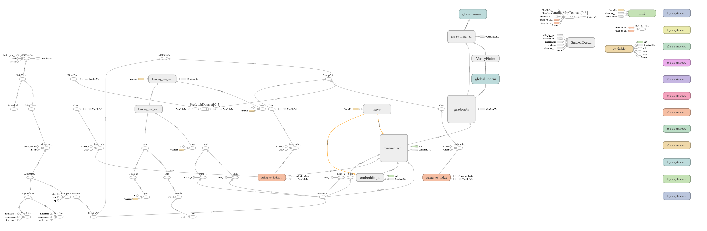

# 4L_GRU_1024_normed_bahdanau

## HPARAMS

    --attention=normed_bahdanau \
    --num_train_steps=12000 \
    --steps_per_stats=100 \
    --num_units=1024 --unit_type=gru \
    --dropout=0.2 --num_layers=2 \

    rest is default

## RESULT

```log
step 100 lr 1 step-time 1.17s wps 4.79K ppl 1156114030.80 gN 4369.59 bleu 0.00, Fri Jan 18 04:40:45 2019
step 200 lr 1 step-time 0.97s wps 5.93K ppl 69647602.57 gN 187883.46 bleu 0.00, Fri Jan 18 04:42:22 2019
step 300 lr 1 step-time 0.93s wps 5.91K ppl 2610749570.51 gN 12455182.66 bleu 0.00, Fri Jan 18 04:43:55 2019
step 400 lr 1 step-time 0.95s wps 5.92K ppl 52143118811.34 gN 980133047.69 bleu 0.00, Fri Jan 18 04:45:30 2019
step 500 lr 1 step-time 0.96s wps 5.95K ppl 52155680408566.24 gN 4072840016.56 bleu 0.00, Fri Jan 18 04:47:06 2019
step 600 lr 1 step-time 0.94s wps 5.93K ppl 456874229804201.19 gN 339502400789.09 bleu 0.00, Fri Jan 18 04:48:40 2019
step 700 lr 1 step-time 0.95s wps 5.92K ppl 5138949701880458.00 gN 4021226861274.22 bleu 0.00, Fri Jan 18 04:50:15 2019
step 800 lr 1 step-time 0.95s wps 5.94K ppl 40858608568310161408.00 gN 49058178550111.19 bleu 0.00, Fri Jan 18 04:51:50 2019
step 900 overflow, stop early*******************************
step 900 lr 1 step-time 0.94s wps 5.95K ppl 417990255296330399744.00 gN 935534256287412.75 bleu 0.00, Fri Jan 18 04:53:24 2019
```

## GRAPH

