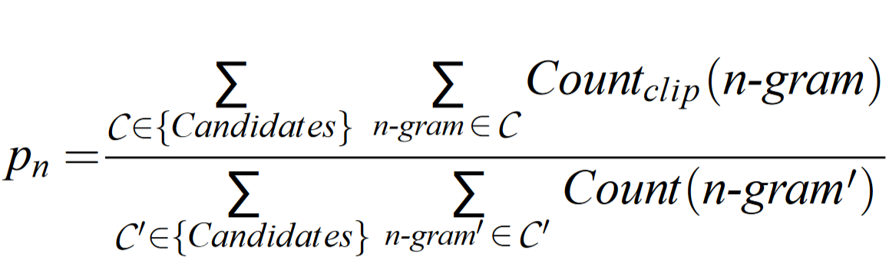
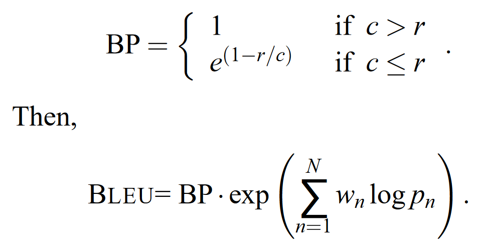

# Báo cáo Final VietAI course3

## __1.Tổng quan cấu trúc NMT và BLEU score__

### __1.1. NMT__

NMT (Neural Machine Translation) là sự kết hợp của dịch máy (Machine Translation - MT) và mạng nơ-ron nhân tạo (Artificial Neural Network - NN). Và cụ thể trong bài báo cáo này thì mạng NN được sử dụng trong mô hình NMT là mạng nơ-ron hồi quy (hoặc truy hồi) (Recurrent Neural Network - RNN) và mô hình NMT được sử dụng là mô hình xây dựng theo kiến trúc NMT của Google, trên nền tảng của thư viện Tensorflow dành cho Python.

Khởi nguồn của MT hoạt động theo cách chia nhỏ câu thành các cụm từ và tiến hành dịch trên từng cụm từ một. Kết quả cuối cùng sẽ là một câu ghép lại từ các cụm từ đã được dịch. Cách tiếp cận này được gọi là dịch theo cụm (pharase-based), và kết quả thì không được ấn tượng lắm vì cách tiếp cận của phương pháp này không thực sự giống với cách mà con người sử dụng trong dịch thuật là đọc toàn bộ câu, nắm ý nghĩa của câu và đưa ra câu dịch tương ứng. Và NMT được xây dựng hoàn toàn dựa trên cách làm này. NMT là cách tiếp cận MT phổ biến trong khoảng 4 năm gần đây và đẫ cho ra các kết quả thực sự tốt, tới mức ngang hoặc hơn cả con người.

Cụ thể về kiến trúc thì NMT là sự kết hợp của 2 thành phân chính là __Seq2Seq__ và __Attention__

#### 1.1.1. Seq2Seq

Kiến trúc Seq2Seq được lấy từ tên của bài nghiên cứu __Sequence to Sequence Learning with Neural Networks__ trình bày một kiến trúc MT mà ở đó, một câu (__Seq__) sẽ được dịch bằng cách đưa vào một bộ mã hóa (__Encoder__) và nối tiếp với một bộ giải mã (__Decoder__) để dịch sang một câu (__2Seq__) ở ngôn ngữ khác.

 
Hình 1. Cấu trúc Encoder-Decoder.

Cụ thể thì NMT sẽ đưa toàn bộ câu ở ngôn ngữ gốc vào Encoder để _nén_ ý nghĩa của câu thành một vector gọi là __context__ (hoặc __thought__), và đưa vector đó sang cho bộ giải mã (Decoder) để chuyển vector thành câu thuộc ngôn ngữ khác (ngôn ngữ đích) mang ý nghĩa tương ứng với câu ở ngôn ngữ gốc. Bài viết này sẽ sử dụng RNN, gated recurrent unit (GRU) hoặc Long Short-term Memory (LSTM), để làm encoder và decoder.

 
Hình 2. Ví dụ cấu trúc NMT.

 Ở ví dụ cấu trúc NMT trình bày ở Hình 2, bộ encoder và decoder đều được cấu tạo từ 2 lớp RNN cùng chiều, chồng lên nhau, tương ứng với màu xanh dương và màu đỏ. Ở đây, ký hiệu "&lts&gt"  sử dụng để báo hiệu bắt đầu quá trình decode và ký hiệu "&lt/s&gt" sử dụng để báo hiệu cho decoder dừng quá trình decode lại.

Việc lựa chọn kiến trúc RNN cho encoder và decoder sẽ tác động rất lớn tới độ phức tạp và độ _nặng_ của hệ thống khi huấn luyện mô hình. Một số lựa chọn có thể bao gồm:
* Loại RNN (unit_type): LSTM, GRU
* Số lớp (nums_layer): độ _sâu_ của mạng RNN, có thể là 2 lớp, 4 lớp hoặc thậm chí là 8 lớp RNN chồng lên nhau
* Số đơn vị (nums_unit): đặc trưng cho _kích thước_ của mạng RNN, kích thước của __vector context__
* Chiều của encoder (encoder_type): 1 chiều, 2 chiều hoặc kết hợp một lớp 2 chiều và nhiều lớp một chiều

Ngoài 2 lớp RNN chồng lên nhau ở 2 bộ encoder và decoder thì trong Hình 2 còn có sự xuất hiện của 3 lớp NN khác là:

* 1 lớp embedding ở encoder
* 1 lớp embedding, 1 lớp projection ở decoder (2 lớp này dùng chung bộ trọng số, chỉ ngược chiều).

Đây là các lớp NN embedding và ứng với mỗi ngôn ngữ sẽ có một bộ NN riêng biệt.

Trong khi embedding sẽ có vai trò chuyển một từ trong __không gian từ điển__ (vocab) của ngôn ngữ, sang không gian _vector_ (có chiều tương ứng với không gian của __vector context__). Thì projection ở decoder sẽ có vai trò chuyển ngược lại một từ thuộc không gian _vector_ sang __không gian từ điển__ (vocab) của ngôn ngữ.

Tại chiều không gian _vector_ này thì encoder sẽ đóng vai trò _nén_ ngữ nghĩa của một câu (tập hợp các từ thuộc không gian _vector_) của ngôn ngữ gốc thành một __vector context__ và đưa sang cho decoder tiến hành _giải nén_ __vector context__ thành một câu (tập hợp các từ thuộc không gian _vector_) của ngôn ngữ đích.

Để cho thuận tiện trong việc tính toán và chuyển đổi qua lại thì các chiều không gian _vector_ này sẽ đều có chung chiều là chiều của __vector context__ (kích thước của mạng RNN).

Và qua các nghiên cứu khác nhau 

### __1.2. BLEU Score__

Bilingual Evaluation Understudy Score hay ngắn gọn là BLEU score là một thang điểm được dùng phổ biến trong đánh giá MT. BLEU được Kishore Papineni và cộng sự đề xuất lần đầu vào năm 2002 qua bài nghiên cứu "a Method for Automatic Evaluation of Machine Translation".

BLEU được tính dựa trên số lượng n-grams giống nhau giữa câu dịch của mô hình (output) với các câu tham chiếu tương ứng (label) có xét tới yếu tố độ dài của câu.

Số n-grams tối đa của BLEU là không giới hạn, nhưng vì xét về ý nghĩa, cụm từ quá dài thường không có nhiều ý nghĩa, và nghiên cứu cũng đã cho thấy là với 4-gram, điểm số BLEU trung bình cho khả năng dịch thuật của con người cũng đã giảm khá nhiều nên n-grams tối đa thường được sử dụng là 4-gram.

Xét bộ câu dịch và tham chiếu có cùng độ dài như sau:

* Output: Đây là cái ghế
* Label 1: Đây là cái bàn
* Label 2: Kia có cái ghế

| 1-gram | Output | Label 1 | Label 2 |
|--------|--------|---------|---------|
| Đây    | 1 | 1 | 0 |
| là     | 1 | 1 | 0 |
| cái    | 1 | 1 | 1 |
| ghế    | 1 | 0 | 1 |

BLEU độc lập 1-gram:

* 1-gram và Label 1: __3/4__ = 0.75
* 1-gram và Label 2: __2/4__ = 0.5
* 1-gram và Label 1 + 2: __4/4__ = 1

| 2-grams | Output | Label 1 | Label 2 |
|---------|--------|---------|---------|
| Đây là  | 1 | 1 | 0 |
| là cái  | 1 | 1 | 0 |
| cái ghế | 1 | 0 | 1 |

Tương tự, BLEU độc lập cho 2-gram sẽ được tính như sau:

* 2-grams và Label 1: __2/3__ = 0.67
* 2-grams và Label 2: __1/3__ = 0.33
* 2-grams và Label 1 + 2: __3/3__ = 1

Công thức tổng quát độ chính xác cho mỗi n-grams:

 
Hình 3. Độ chính xác của n-gram.

Với cách tính này, thì sẽ dễ dàng thấy rằng nếu output càng ngắn, thì độ chính xác được tính theo công thức sẽ càng cao.
Ví dụ với cùng 2 Label trên, nếu output chỉ ra duy nhất chữ __"cái"__ thì BLEU sẽ bằng 1.
Lúc này, để hạn chế việc câu quá ngắn thì BP (brevity penalty) được sử dụng để so sánh độ dài output __c__ và độ dài câu tham chiếu __r__. Công thức tổng quát cho BLEU score lúc này sẽ là:

Công thức tổng quát độ chính xác cho mỗi n-grams:

 
Hình 4. BLEU score.

Quay lại ví dụ ban đầu, BLEU chung cho cả 1-gram và 2-gram với trọng số __*wn*__ ngang nhau $\tfrac {1}{2}$ sẽ là :

* 1-gram + 2-grams và Label 1:
  
    $\LARGE{e^{(0.5 \times log\tfrac {3}{4}+0.5 \times log\tfrac {2}{3})}} = 0.71$

* 1-gram + 2-grams và Label 2:
  
  $\LARGE{e^{(0.5 \times log\tfrac {2}{4}+0.5 \times log\tfrac {1}{3})}} = 0.41$

* 1-gram + 2-grams và Label 1 + 2:
  
  $\LARGE{e^{(0.5 \times log\tfrac {4}{4}+0.5 \times log\tfrac {3}{3})}} = 1$

Đối với trường hợp có nhiều hơn 1 Label và các Label có độ dài khác nhau thì lúc này, BP sẽ được tính theo Label nào có chênh lệch độ dài so Output là ít nhất.